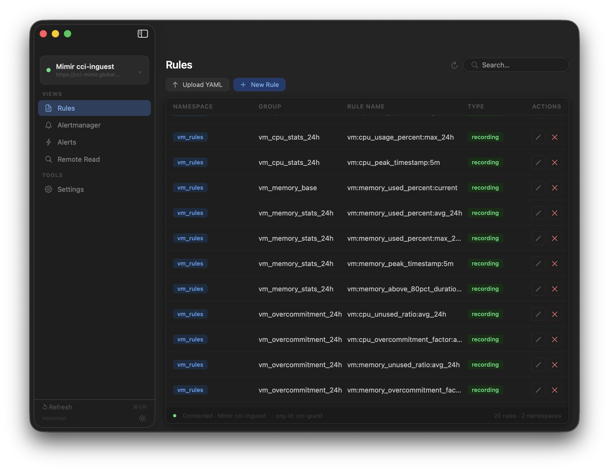
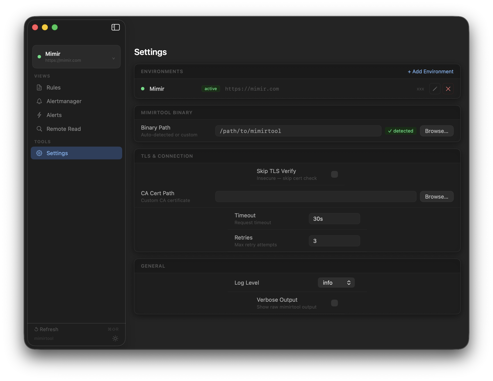

# MimirLens

A native macOS application that provides a graphical interface for [mimirtool](https://grafana.com/docs/mimir/latest/manage/tools/mimirtool/), the official CLI for Grafana Mimir. Instead of constructing `mimirtool` commands by hand, MimirLens lets you manage your Mimir cluster through a clean, dark-themed UI.

---

## Screenshots





---

## Features

- **Rules** — Browse, search, edit, upload, and delete recording and alerting rules across all namespaces
- **Alertmanager** — View, edit, push, and delete your Alertmanager configuration with a built-in YAML editor
- **Alerts** — Live view of firing and pending alerts with label filtering and 30-second auto-refresh
- **Remote Read** — Query your Mimir remote read API by selector and time range, with CSV export
- **Environments** — Manage multiple Mimir clusters with per-environment URL, tenant ID, and TLS settings
- **Auto-detection** — Automatically finds your `mimirtool` binary from common Homebrew and system paths

---

## Requirements

- macOS 13 Ventura or later
- [`mimirtool`](https://github.com/grafana/mimir/releases) installed locally

```bash
brew install mimirtool
```

---

## Installation

### Build from source

1. Clone the repo:
   ```bash
   git clone https://github.com/Dominik-esb/MimirLens.git
   cd MimirLens
   ```

2. Generate the Xcode project (requires [xcodegen](https://github.com/yonaskolb/XcodeGen)):
   ```bash
   brew install xcodegen
   xcodegen generate
   ```

3. Open and build:
   ```bash
   open MimirToolUI.xcodeproj
   ```
   Or build from the command line:
   ```bash
   xcodebuild build -scheme MimirToolUI
   ```

---

## Getting Started

1. **Set your mimirtool binary** — Open Settings and either paste the path or click Browse. If you installed via Homebrew, MimirLens detects it automatically.

2. **Add an environment** — In Settings → Environments, click **+ Add Environment** and fill in your Mimir cluster URL, tenant/org ID, and any TLS options.

3. **Start using it** — Select your environment from the sidebar and navigate to Rules, Alertmanager, Alerts, or Remote Read.

---

## Views

### Rules

Browse all rule namespaces and groups fetched from your Mimir instance. Click the pencil icon on any rule to open it in the YAML editor, make changes, and push directly to Mimir. Upload a local YAML file or create a new rule group from scratch.

### Alertmanager

View and edit your Alertmanager configuration in a full-height YAML editor. Push changes directly to Mimir or delete the configuration entirely. A summary panel on the right shows the configured receivers at a glance.

### Alerts

See all currently firing and pending alerts. Filter by state (All / Firing / Pending) or search by label. Toggle auto-refresh to poll every 30 seconds.

### Remote Read

Query your Mimir instance's remote read API using a PromQL selector and a time range. Results are displayed as a series table (metric name, labels, latest value, timestamp). Export the results to CSV.

### Settings

| Setting | Description |
|---------|-------------|
| Environments | Add, edit, and delete Mimir cluster configurations |
| Binary Path | Path to the `mimirtool` binary (auto-detected or custom) |
| TLS | Skip verify, custom CA certificate |
| Timeout / Retries | Connection options |
| Log Level | `info`, `debug`, `warn`, `error` |

---

## Environment Configuration

Each environment stores:

| Field | Description |
|-------|-------------|
| Name | Display name |
| URL | Mimir cluster base URL (e.g. `https://mimir.example.com`) |
| Org / Tenant ID | Passed as `--id` to mimirtool and `X-Scope-OrgID` header |
| Skip TLS Verify | Disables certificate verification |
| CA Cert Path | Custom CA for self-signed certificates |
| Timeout | Per-request timeout (e.g. `30s`) |
| Retries | Number of retry attempts |

Environments are stored in `~/Library/Application Support/MimirToolUI/environments.json`.

---

## Architecture

```
MimirToolUI/
├── Services/
│   ├── MimirtoolRunner.swift     # Wraps Process() to invoke mimirtool
│   ├── AlertsService.swift       # HTTP client for Prometheus alerts API
│   └── EnvironmentStore.swift    # Persists environments to disk
├── ViewModels/
│   ├── RulesViewModel.swift
│   ├── AlertmanagerViewModel.swift
│   ├── AlertsViewModel.swift
│   └── RemoteReadViewModel.swift
├── Views/
│   ├── Sidebar/
│   ├── Rules/
│   ├── Alertmanager/
│   ├── Alerts/
│   ├── RemoteRead/
│   ├── Settings/
│   └── Shared/                   # TagView, StatusBarView, ErrorBannerView, YAMLEditorView
└── Models/                       # MimirEnvironment, Rule, MimirAlert, etc.
```

**Tech stack:** Swift 6 · SwiftUI · MVVM · `@MainActor` · async/await · No third-party dependencies

---

## Development

### Run tests

```bash
xcodebuild test -scheme MimirToolUI \
  CODE_SIGN_IDENTITY=- \
  CODE_SIGNING_REQUIRED=NO \
  CODE_SIGNING_ALLOWED=NO
```

### Project generation

The project uses [xcodegen](https://github.com/yonaskolb/XcodeGen). Edit `project.yml` to change targets, build settings, or add new source directories, then re-run `xcodegen generate`.

---

## License

Apache License 2.0 — see [LICENSE](LICENSE) for details.
